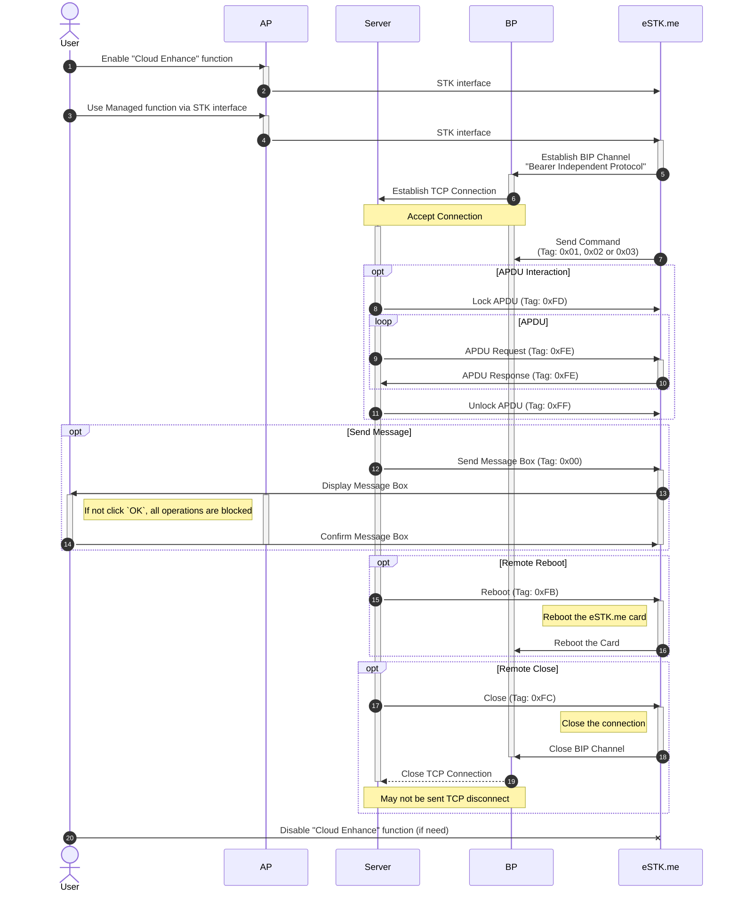

# Remote LPA Serverr Protocol Design

The protocol runs on TCP, default port is `1888`

Available since eSTK.me 2.1.0 firmware

Official Reference implementation: see [rlpa-Serverr.php](../rlpa-Serverr.php)

## Packet Structure

The is [KLV] format, but length is unsigned short (16 bits, [LE])

[KLV]: https://en.wikipedia.org/wiki/KLV
[LE]: https://en.wikipedia.org/wiki/Endianness

|    Tag | Command                         |
| -----: | ------------------------------- |
| `0x00` | Message Box                     |
| `0x01` | [Remote Managemnt][managed]     |
| `0x02` | [Download Profile][managed]     |
| `0x03` | [Process Notification][managed] |
| `0xFB` | Reboot                          |
| `0xFC` | Close                           |
| `0xFD` | Lock APDU                       |
| `0xFE` | Send APDU Command               |
| `0xFF` | Unlock APDU                     |

[managed]: #managed-function

## Managed function

## References

- [TS.38 STK Device Requirements - UX Enhancements](https://www.gsma.com/newsroom/wp-content/uploads//TS.38-v2.0.pdf)
